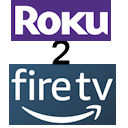

# Roku to FireTv Converter
The Roku 2 FireTV converter is a software tool that easily converts your Roku MRSS or JSON feed file to an Amazon FireTV feed file.  Using this tool will allow you to maintain one feed file that serves two seprate platforms (Roku and Amazon).

**NOTE: This software is not endorsed by or affiliated with Roku or Amazon in any way.**

# Prerequisites
* 64 Bit Windows: 7, 8, 10.
* .Net Framework 4.7.1
* 5MB Free Disk Space.
* Minimum screen resolution: 1366 X 768.

# Installation
Please download the setup file from the latest release.

**NOTE**: The installer requires permission to create folders on your pc for the software to work.  Please allow the installer to create these folders.  Failure to do so will result in a software failure.

# Support
THE SOFTWARE IS PROVIDED "AS IS", WITHOUT WARRANTY OF ANY KIND, EXPRESS OR IMPLIED, INCLUDING BUT NOT LIMITED TO THE WARRANTIES OF MERCHANTABILITY, FITNESS FOR A PARTICULAR PURPOSE AND NONINFRINGEMENT.

Software support is available by submitting an "issue".  Please attach any files that may help demonstrate the "issue".

# License
Please read the license before using the software.

# Author
Michael Harnad
